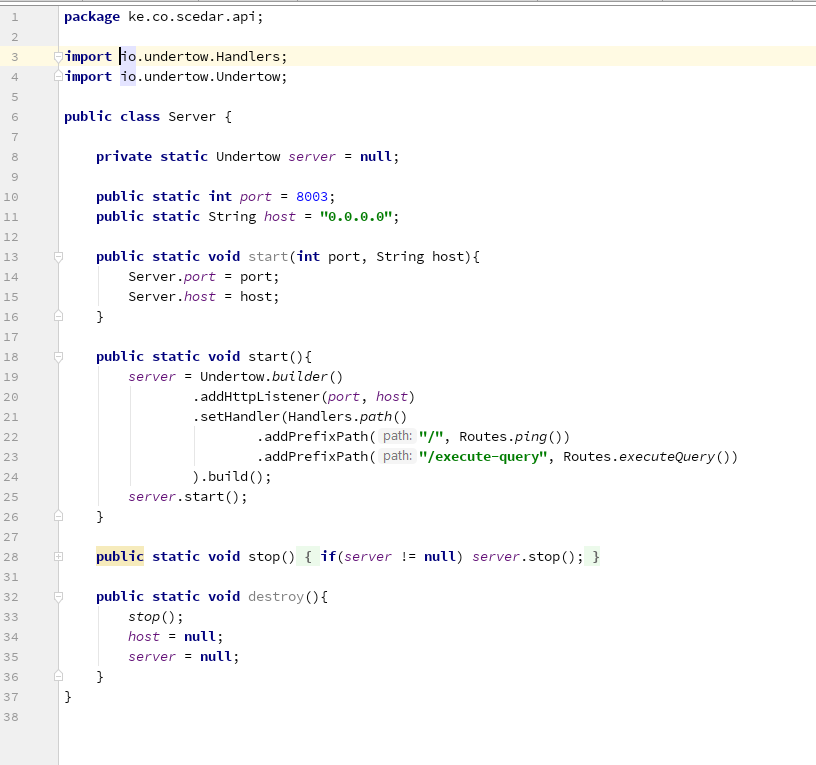
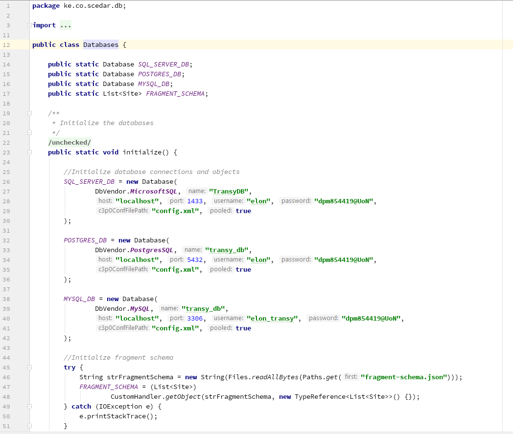
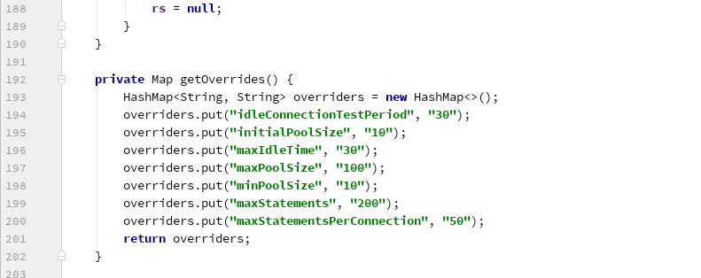
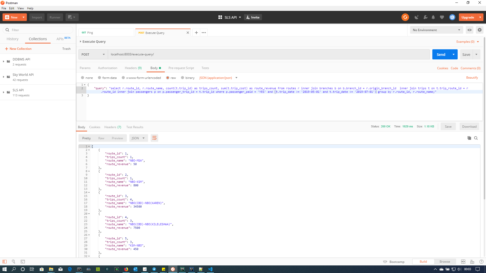

# ddbms
Simple Distributed Database Management System API (Java)

[Click to watch sample ddbms usage](https://youtu.be/42SOyMNJ68I)

### Requirements
| # | Item | Version|
|-----|------------|-------|
|1. | Microsoft SQL Server | 2008 or later |
|2. | MySQL Database Server | \>= 5.7.x |
|3. | Postgres SQL Server | \>=9.x |
|4. | Maven (Java dependency manager) | \>=3.4.x |
|5. | Java JRE (JDK is preferred) | =1.8.x (Java 11 might bring some issues) |

### Easy setup
>Note: This guide assumes that you've satisfied the above requirements

#### Project structure
- Verify the project structure is as below:
```bash
$PATH/DDBMS
├───.gitignore
├───resources
│   └─ ...
├───fragment-schema.json
├───lib
│   └─ ...
├───LICENSE
├───pom.xml
├───README.md
└───src
    ├───main
    │   └─ ...      
    └───test
```
#### Database setup
- `cd` into the `resources` folder 
- You should see the following files
```bash
├───site1.sqlserver.sql
├───site2.postgresql.sql
└───site3.mysql.sql
```
- For simplicity, I just dumped the databases as normal `CREATE` and `INSERT` sql statements. So, just open the files, 
copy the sql scripts and execute them in your various DB server setups
>NB: 
> - Ensure you create the databases properly. The `CREATE DATATBASE [DB]` statements are at the top of each sql script
> - Ensure permissions and DB owners are assigned appropriately. You will need authentication information later on in the API
> - site 1 (MS SQL Server is the main site)

#### ddbms API setup
- `cd` into the root directory of the project.
- `cd` again into `lib` directory
- On your terminal, execute `(elon-bash)$ mvn -version` to verify that you have [Maven](https://maven.apache.org/) and it's accessible
- `cd` back into the root directory of the project
- Ensure you can see `pom.xml` file and the `src` directory
- Import the libraries in the `lib` directory into your project by executing the following...
```bash
(elon-bash)$ mvn install:install-file -Dfile=lib/c3p0-0.9.5.2.jar -DgroupId=com.c3p0 -DartifactId=c3p0 -Dversion=0.0.LOCAL -Dpackaging=jar
(elon-bash)$ mvn install:install-file -Dfile=lib/concurrent-1.3.4.jar -DgroupId=com.concurrent -DartifactId=concurrent -Dversion=0.0.LOCAL -Dpackaging=jar
(elon-bash)$ mvn install:install-file -Dfile=lib/gsp.jar -DgroupId=com.gsp -DartifactId=gsp -Dversion=0.0.LOCAL -Dpackaging=jar
(elon-bash)$ mvn install:install-file -Dfile=lib/jackson-annotations-2.9.8.jar -DgroupId=com.jackson-annotations -DartifactId=jackson-annotations -Dversion=0.0.LOCAL -Dpackaging=jar
(elon-bash)$ mvn install:install-file -Dfile=lib/jackson-core-2.9.8.jar -DgroupId=com.jackson-core -DartifactId=jackson-core -Dversion=0.0.LOCAL -Dpackaging=jar
(elon-bash)$ mvn install:install-file -Dfile=lib/jackson-databind-2.9.8.jar -DgroupId=com.jackson-databind -DartifactId=jackson-databind -Dversion=0.0.LOCAL -Dpackaging=jar
(elon-bash)$ mvn install:install-file -Dfile=lib/jackson-dataformat-xml-2.9.8.jar -DgroupId=com.jackson-dataformat -DartifactId=jackson-dataformat -Dversion=0.0.LOCAL -Dpackaging=jar
(elon-bash)$ mvn install:install-file -Dfile=lib/jackson-module-jaxb-annotations-2.9.8.jar -DgroupId=com.jackson-module -DartifactId=jackson-module -Dversion=0.0.LOCAL -Dpackaging=jar
(elon-bash)$ mvn install:install-file -Dfile=lib/jansi-1.17.1.jar -DgroupId=com.jansi -DartifactId=jansi -Dversion=0.0.LOCAL -Dpackaging=jar
(elon-bash)$ mvn install:install-file -Dfile=lib/jboss-common-4.2.2.GA.jar -DgroupId=com.jboss-common -DartifactId=jboss-common -Dversion=0.0.LOCAL -Dpackaging=jar
(elon-bash)$ mvn install:install-file -Dfile=lib/jboss-logging-3.3.0.Final.jar -DgroupId=com.jboss-logging -DartifactId=jboss-logging -Dversion=0.0.LOCAL -Dpackaging=jar
(elon-bash)$ mvn install:install-file -Dfile=lib/jboss-logmanager-2.1.10.Final.jar -DgroupId=com.jboss-logmanager -DartifactId=jboss-logmanager -Dversion=0.0.LOCAL -Dpackaging=jar
(elon-bash)$ mvn install:install-file -Dfile=lib/jnpserver-4.2.3.GA.jar -DgroupId=com.jnpserver -DartifactId=jnpserver -Dversion=0.0.LOCAL -Dpackaging=jar
(elon-bash)$ mvn install:install-file -Dfile=lib/junit-jupiter-api-5.4.2.jar -DgroupId=com.junit-jupiter -DartifactId=junit-jupiter -Dversion=0.0.LOCAL -Dpackaging=jar
(elon-bash)$ mvn install:install-file -Dfile=lib/junit-platform-commons-1.5.0-M1.jar -DgroupId=com.junit-platform-commons -DartifactId=junit-platform-commons -Dversion=0.0.LOCAL -Dpackaging=jar
(elon-bash)$ mvn install:install-file -Dfile=lib/junit-platform-launcher-1.4.2.jar -DgroupId=com.junit-platform-launcher -DartifactId=junit-platform-launcher -Dversion=0.0.LOCAL -Dpackaging=jar
(elon-bash)$ mvn install:install-file -Dfile=lib/log4j-api-2.11.2.jar -DgroupId=com.log4j-api -DartifactId=log4j-api -Dversion=0.0.LOCAL -Dpackaging=jar
(elon-bash)$ mvn install:install-file -Dfile=lib/log4j-core-2.11.2.jar -DgroupId=com.log4j-core -DartifactId=log4j-core -Dversion=0.0.LOCAL -Dpackaging=jar
(elon-bash)$ mvn install:install-file -Dfile=lib/log4j-slf4j-impl-2.11.2.jar -DgroupId=com.log4j-slf4j -DartifactId=log4j-slf4j -Dversion=0.0.LOCAL -Dpackaging=jar
(elon-bash)$ mvn install:install-file -Dfile=lib/mchange-commons-java-0.2.11.jar -DgroupId=com.mchange-commons -DartifactId=mchange-commons -Dversion=0.0.LOCAL -Dpackaging=jar
(elon-bash)$ mvn install:install-file -Dfile=lib/mssql-jdbc-7.0.0.jre8.jar -DgroupId=com.mssql-jdbc -DartifactId=mssql-jdbc -Dversion=0.0.LOCAL -Dpackaging=jar
(elon-bash)$ mvn install:install-file -Dfile=lib/mysql-connector-java-8.0.15.jar -DgroupId=com.mysql-connector -DartifactId=mysql-connector -Dversion=0.0.LOCAL -Dpackaging=jar
(elon-bash)$ mvn install:install-file -Dfile=lib/postgresql-42.2.5.jar -DgroupId=com.postgresql -DartifactId=postgresql -Dversion=0.0.LOCAL -Dpackaging=jar
(elon-bash)$ mvn install:install-file -Dfile=lib/stax2-api-3.0.1.jar -DgroupId=com.stax2-api -DartifactId=stax2-api -Dversion=0.0.LOCAL -Dpackaging=jar
(elon-bash)$ mvn install:install-file -Dfile=lib/undertow-core-2.0.1.Final.jar -DgroupId=com.undertow-core -DartifactId=undertow-core -Dversion=0.0.LOCAL -Dpackaging=jar
(elon-bash)$ mvn install:install-file -Dfile=lib/xnio-api-3.3.8.Final.jar -DgroupId=com.xnio-api -DartifactId=xnio-api -Dversion=0.0.LOCAL -Dpackaging=jar
(elon-bash)$ mvn install:install-file -Dfile=lib/xnio-nio-3.3.8.Final.jar -DgroupId=com.xnio-nio -DartifactId=xnio-nio -Dversion=0.0.LOCAL -Dpackaging=jar
```
>NB:
> - You can combine them into one long command. See below. But if unsure, just execute them one by one
> ```bash
> mvn install:install-file -Dfile=lib/c3p0-0.9.5.2.jar -DgroupId=com.c3p0 -DartifactId=c3p0 -Dversion=0.0.LOCAL -Dpackaging=jar && mvn install:install-file -Dfile=lib/concurrent-1.3.4.jar -DgroupId=com.concurrent -DartifactId=concurrent -Dversion=0.0.LOCAL -Dpackaging=jar && mvn install:install-file -Dfile=lib/gsp.jar -DgroupId=com.gsp -DartifactId=gsp -Dversion=0.0.LOCAL -Dpackaging=jar && mvn install:install-file -Dfile=lib/jackson-annotations-2.9.8.jar -DgroupId=com.jackson-annotations -DartifactId=jackson-annotations -Dversion=0.0.LOCAL -Dpackaging=jar && mvn install:install-file -Dfile=lib/jackson-core-2.9.8.jar -DgroupId=com.jackson-core -DartifactId=jackson-core -Dversion=0.0.LOCAL -Dpackaging=jar && mvn install:install-file -Dfile=lib/jackson-databind-2.9.8.jar -DgroupId=com.jackson-databind -DartifactId=jackson-databind -Dversion=0.0.LOCAL -Dpackaging=jar && mvn install:install-file -Dfile=lib/jackson-dataformat-xml-2.9.8.jar -DgroupId=com.jackson-dataformat -DartifactId=jackson-dataformat -Dversion=0.0.LOCAL -Dpackaging=jar && mvn install:install-file -Dfile=lib/jackson-module-jaxb-annotations-2.9.8.jar -DgroupId=com.jackson-module -DartifactId=jackson-module -Dversion=0.0.LOCAL -Dpackaging=jar && mvn install:install-file -Dfile=lib/jansi-1.17.1.jar -DgroupId=com.jansi -DartifactId=jansi -Dversion=0.0.LOCAL -Dpackaging=jar && mvn install:install-file -Dfile=lib/jboss-common-4.2.2.GA.jar -DgroupId=com.jboss-common -DartifactId=jboss-common -Dversion=0.0.LOCAL -Dpackaging=jar && mvn install:install-file -Dfile=lib/jboss-logging-3.3.0.Final.jar -DgroupId=com.jboss-logging -DartifactId=jboss-logging -Dversion=0.0.LOCAL -Dpackaging=jar && mvn install:install-file -Dfile=lib/jboss-logmanager-2.1.10.Final.jar -DgroupId=com.jboss-logmanager -DartifactId=jboss-logmanager -Dversion=0.0.LOCAL -Dpackaging=jar && mvn install:install-file -Dfile=lib/jnpserver-4.2.3.GA.jar -DgroupId=com.jnpserver -DartifactId=jnpserver -Dversion=0.0.LOCAL -Dpackaging=jar && mvn install:install-file -Dfile=lib/junit-jupiter-api-5.4.2.jar -DgroupId=com.junit-jupiter -DartifactId=junit-jupiter -Dversion=0.0.LOCAL -Dpackaging=jar && mvn install:install-file -Dfile=lib/junit-platform-commons-1.5.0-M1.jar -DgroupId=com.junit-platform-commons -DartifactId=junit-platform-commons -Dversion=0.0.LOCAL -Dpackaging=jar && mvn install:install-file -Dfile=lib/junit-platform-launcher-1.4.2.jar -DgroupId=com.junit-platform-launcher -DartifactId=junit-platform-launcher -Dversion=0.0.LOCAL -Dpackaging=jar && mvn install:install-file -Dfile=lib/log4j-api-2.11.2.jar -DgroupId=com.log4j-api -DartifactId=log4j-api -Dversion=0.0.LOCAL -Dpackaging=jar && mvn install:install-file -Dfile=lib/log4j-core-2.11.2.jar -DgroupId=com.log4j-core -DartifactId=log4j-core -Dversion=0.0.LOCAL -Dpackaging=jar && mvn install:install-file -Dfile=lib/log4j-slf4j-impl-2.11.2.jar -DgroupId=com.log4j-slf4j -DartifactId=log4j-slf4j -Dversion=0.0.LOCAL -Dpackaging=jar && mvn install:install-file -Dfile=lib/mchange-commons-java-0.2.11.jar -DgroupId=com.mchange-commons -DartifactId=mchange-commons -Dversion=0.0.LOCAL -Dpackaging=jar && mvn install:install-file -Dfile=lib/mssql-jdbc-7.0.0.jre8.jar -DgroupId=com.mssql-jdbc -DartifactId=mssql-jdbc -Dversion=0.0.LOCAL -Dpackaging=jar && mvn install:install-file -Dfile=lib/mysql-connector-java-8.0.15.jar -DgroupId=com.mysql-connector -DartifactId=mysql-connector -Dversion=0.0.LOCAL -Dpackaging=jar && mvn install:install-file -Dfile=lib/postgresql-42.2.5.jar -DgroupId=com.postgresql -DartifactId=postgresql -Dversion=0.0.LOCAL -Dpackaging=jar && mvn install:install-file -Dfile=lib/stax2-api-3.0.1.jar -DgroupId=com.stax2-api -DartifactId=stax2-api -Dversion=0.0.LOCAL -Dpackaging=jar && mvn install:install-file -Dfile=lib/undertow-core-2.0.1.Final.jar -DgroupId=com.undertow-core -DartifactId=undertow-core -Dversion=0.0.LOCAL -Dpackaging=jar && mvn install:install-file -Dfile=lib/xnio-api-3.3.8.Final.jar -DgroupId=com.xnio-api -DartifactId=xnio-api -Dversion=0.0.LOCAL -Dpackaging=jar && mvn install:install-file -Dfile=lib/xnio-nio-3.3.8.Final.jar -DgroupId=com.xnio-nio -DartifactId=xnio-nio -Dversion=0.0.LOCAL -Dpackaging=jar
> ```

- Next clean the project by executing `(elon-bash)$ mvn clean`
- Then compile and build the project by executing `(elon-bash)$ mvn compile`

#### ddbms API configuration
- The API used standalone [Undertow](http://undertow.io/). You can find go through it's [Documentation](http://undertow.io/undertow-docs/undertow-docs-2.0.0/index.html) if interested
- Configure the API server in `$PATH/ddbms/src/main/java/ke/co/scedar/api/Server.java`

    - Here, you can change the `host`, `port` and `api-path (/execute-query)`
- Configure database connections in `$PATH/ddbms/src/main/java/ke/co/scedar/db/Databases.java`

    - Here you can need to set the relevant auth info. Assuming we used similar database names, you just have to change the `host`, `port`, `username` and `password`. Though I have used the default ports  for the various database servers
    - The `c3p0ConfigFilePath` should be left as is. We  will look at it's configs next
- Optionally, you can choose to configure [C3P0](https://www.mchange.com/projects/c3p0/) in `$PATH/ddbms/src/main/java/ke/co/scedar/db/Database.java`

    - Depending on your usage, change the properties as you see fit.
- Then generate an executable of the project by executing `(elon-bash)$ mvn clean package`
- This will generate an output directory called `target`
- Expected structure
```bash
$PATH/ddbms/target
├───classes
│   └- ...
├───ddbms_api.jar
├───generated-sources
│   └───annotations
├───generated-test-sources
│   └───test-annotations
├───maven-archiver
├───maven-status
│   └─ ...
├───original-ddbms_api.jar
├───surefire-reports
└───test-classes
    └─ ...
```
- Note the `ddbms_api.jar`, that's the executable
- If you've seen that. Then your setup is correct.
- You can the run the executable by `(elon-bash)$ java -jar ddbms_api.jar`
- If you wish to run it with [Maven](https://maven.apache.org/), run `(elon-bash)$ mvn exec:java`. But make sure you have executed either `(elon-bash)$ mvn clean package` or `(elon-bash)$ mvn install`

#### Use ddbms API
- There a number of sample queries you can try out.
- For the very simple ones, like the ones without joins, you can compose your own and try executing.
- ddbms API will try and validate them against the `fragment-schema.json` and show relevant logs
- Here are some I have  prepared.
    - Sample 1:
        ```sql
        select driver_id, driver_last_name
        from drivers
        where registration_branch_id = 2;
        ```
    - Sample 2:
        ```sql
        select route_id, route_name 
        from routes 
        where origin_branch_id = 1
        ```
    - Sample 3 (Without filter):
        - Generates revenue per route report for 'May - June 2019'
        ```sql
        select r.route_id, r.route_name, count(t.trip_id) as trips_count, sum(t.trip_cost) as route_revenue
        from routes r
                 inner join branches b on b.branch_id = r.origin_branch_id
                 inner join trips t on t.trip_route_id = r.route_id
                 inner join passengers p on p.passenger_trip_id = t.trip_id
        where p.passenger_paid = 'YES'
          and (t.trip_date >= '2019-05-01' and t.trip_date <= '2019-07-01')
        group by r.route_id, r.route_name;
        ```
    - Sample 4 (filter `r.route_name = 'NBO(CBD)-NBO(KAREN)'`):
        - Generates revenue for route `'NBO(CBD)-NBO(KAREN)'` report for 'May - June 2019'
        ```sql
        select r.route_id, r.route_name, count(t.trip_id) as trips_count, sum(t.trip_cost) as route_revenue
        from routes r
                 inner join branches b on b.branch_id = r.origin_branch_id
                 inner join trips t on t.trip_route_id = r.route_id
                 inner join passengers p on p.passenger_trip_id = t.trip_id
        where p.passenger_paid = 'YES'
          and (t.trip_date >= '2019-05-01' and t.trip_date <= '2019-07-01')
          and r.route_name = 'NBO(CBD)-NBO(KAREN)'
        group by r.route_id, r.route_name;
        ```
- To test them out, you can go the `curl` way but I'd prefer using `Postman` or an equivalent.
- Here is my `Postman` setup:


>NB: Note the query is sent as a `json` object in the `Request Body` of the request, under the `key`: **query**

- Take it for a spin and test it out. I haven't done comprehensive tests yet.
